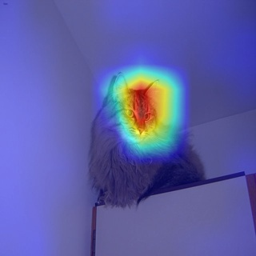
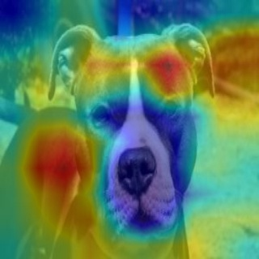

# Cat vs Dog Classifier with Grad-CAM 

---

Project Overview

A lightweight deep-learning classifier that distinguishes **cats** and **dogs** using a CNN (PyTorch).  
The project includes **Grad-CAM visualizations** to highlight the image regions the model focuses on when predicting.

Below are **example input images** and the corresponding **Grad-CAM outputs**.

---

## Example Input Images

### Dog Input:

---

## Example Grad-CAM Outputs (Model Attention)

### Cat Grad-CAM:

### Dog Grad-CAM:

---

Features

✓ Train a binary classifier (Cat / Dog)  
✓ Run inference on single images or entire folders  
✓ Generate Grad-CAM heatmaps  
✓ Colab notebook for quick experimentation  
✓ Clean & reproducible project structure  

---

